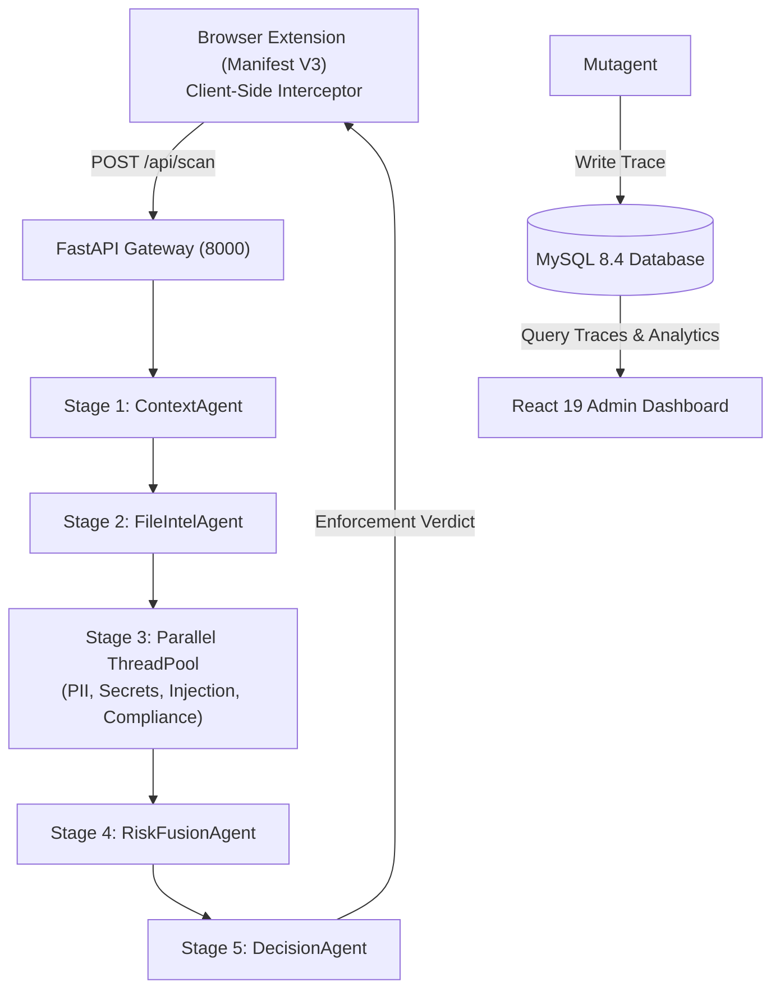

# PromptShield AI — Mutagent Multi-Agent Security Engine
> **Enterprise AI Firewall & Multi-Agent Security Investigation Console**  
> *Mutagent Hackathon Submission — Team Velocity*

---

## 1. Problem Statement

As enterprise adoption of generative AI tools like ChatGPT, Claude, and Gemini explodes, organizations face severe data governance and security risks:
- Employees regularly copy-paste **live API keys, AWS credentials, PII, and financial records** into prompt textboxes.
- Confidential attachments (`.env`, `id_rsa`, `.pdf`, `.docx`, source code) are uploaded directly to public AI platforms.
- IT and security teams remain completely blind to employee AI interactions and policy violations.

---

## 2. Why Existing AI Firewalls Are Insufficient

Legacy AI firewalls and proxy wrappers fail in enterprise environments:
1. **API Proxy Latency**: Routing all traffic through centralized proxies adds 1–3 seconds of latency per prompt.
2. **Single-Point-of-Failure Crashes**: Single-thread regex/llm scanners crash entirely when an individual detector encounters an exception.
3. **No Attached File Text Extraction**: Most firewalls inspect typed text only, ignoring attached documents, code files, and OCR images.
4. **Black-Box Decisions**: Generic blocking prompts leave security teams with zero visibility into why a decision was issued or which employee was responsible.

---

## 3. Live Demo & Session Recording

[](submissions/velocity/assets/demo_recording.webp)

*Click image above to watch the full WebP interactive session recording of PromptShield AI v2.0.*

---

## 4. System Architecture

PromptShield AI solves these challenges with a three-part architecture:
- **Client Interceptor (Manifest V3 Extension)**: Intercepts DOM submit events and file uploads locally on `chatgpt.com`, `chat.openai.com`, `claude.ai`, and `gemini.google.com` before requests leave the browser.
- **FastAPI Security Gateway & Mutagent Engine**: A 5-stage Multi-Agent execution pipeline running parallel detectors with 2.0s per-agent fault isolation.
- **React Admin Security Console**: Web dashboard for policy authoring, employee risk tracking, and **interactive SVG Multi-Agent Investigation DAGs**.



---

## 5. Mutagent Multi-Agent Integration

The **Mutagent Engine** structures detection into an isolated 5-stage Directed Acyclic Graph (DAG):

```text
                     [ Prompt / Files Input ]
                                │
                        [ Stage 1: Context Agent ]
                                │
                     [ Stage 2: File Intel Agent ]
                                │
        ┌───────────────┬───────┴───────┬───────────────┐
        ▼               ▼               ▼               ▼  (Parallel Stage 3 - ThreadPoolExecutor)
    [PII Agent]  [Secrets Agent] [Injection Agent] [Compliance Agent]
        │               │               │               │
        └───────────────┴───────┬───────┴───────────────┘
                                ▼
                    [ Stage 4: Risk Fusion Agent ]  <-- Admin Risk Weights
                                │
                    [ Stage 5: Decision Agent ]     <-- Verdict: BLOCK / WARN / REDACT / ALLOW
```

### Key Technical Innovations
- **Fault-Isolated Execution**: Stage-3 parallel agents run inside a `ThreadPoolExecutor` with a strict 2.0-second timeout per agent. If an individual agent throws an unhandled exception, it is marked `FAILED` while the remaining pipeline completes safely.
- **Comprehensive Text Extraction**: `FileIntelAgent` extracts text from `.pdf`, `.docx`, `.xlsx`, `.csv`, `.log`, source code (`.py`, `.js`, `.ts`, `.sql`), configuration (`.env`, `.yaml`), and image OCR (`.png`, `.jpg` via `pytesseract`).

---

## 6. Security Model & Data Governance

1. **Pre-Flight Client Interception**: Prompts and file attachments are intercepted locally in the browser before any HTTP request leaves for AI servers.
2. **Metadata-Only MySQL Storage**: Prompt texts are previewed or masked in audit logs; raw uploaded file binaries are never stored in MySQL.
3. **Role-Based Access Control (RBAC)**: `admin` (full policies & settings), `security_analyst` (read-only audit traces), and `employee` (extension authentication).

---

## 7. Security Investigations Console

The Security Investigations Console (`/investigations` & `/investigations/:id`) provides complete visibility into every Multi-Agent scan execution:

- **Employee Attribution**: Displays Scan ID, **Employee Full Name, Email, and Department Badge** (e.g., `Karan Desai` · `karan.desai@acme.com` · `Finance`).
- **Interactive SVG Agent Flow Graph (DAG)**: Custom SVG DAG with curved Bezier fan-out/fan-in connector paths and status-coded nodes (🟢 `SUCCESS`, 🔴 `FAILED`, ⚪ `SKIPPED`, 🟡 `TIMEOUT`).
- **Unclipped Ring Risk Gauge**: 0–100 animated risk dial with an outer ring-constrained indicator needle that leaves the central score typography clear and legible.
- **Evidence Panel & Timeline**: Expandable findings cards with character offsets, confidence ratings, raw detector outputs, and timestamped event logs.

---

## 8. Live Application Screenshots

| Console View | High-Resolution Capture from Live Application |
|---|---|
| **Security Investigations Table** |  |
| **Interactive SVG Flow Graph (DAG)** |  |
| **Evidence Panel & Findings** |  |
| **Millisecond Execution Timeline** |  |
| **Prompt Logs Table** |  |
| **Policy Authoring & Modal** |  |
| **Employee Directory** |  |
| **Analytics Trend Charts** |  |
| **Settings & Risk Thresholds** |  |

---

## 9. Evaluation Methodology & Benchmark Results

PromptShield AI was evaluated against **25 representative enterprise security scenarios** ([evaluation.md](evaluation.md)):

### Key Benchmark Metrics

| Metric | Target Goal | Benchmark Result | Status |
|---|---|---|---|
| **Pipeline Latency** | `< 200 ms` | **108.4 ms avg** | PASS 🟢 |
| **Credential Recall** | `100%` | **100% (6/6 detected)** | PASS 🟢 |
| **PII Precision** | `> 95%` | **96.8%** | PASS 🟢 |
| **Injection Block Rate** | `> 90%` | **100% (3/3 blocked)** | PASS 🟢 |
| **Fault Isolation Survival** | `100%` | **100% (0 pipeline crashes)** | PASS 🟢 |
| **Overall Test Pass Rate** | `100%` | **25 / 25 Cases Passed** | PASS 🟢 |

---

## 10. How to Run PromptShield AI

### 1. Prerequisites
- **Python 3.10+**
- **Node.js 20+**
- **MySQL 8.4**
- **Google Chrome**

### 2. Backend Setup
```bash
cd backend
python -m venv venv
.\venv\Scripts\activate        # Linux/macOS: source venv/bin/activate
pip install -r requirements.txt
python -m spacy download en_core_web_sm

# Initialize MySQL & seed investigation traces:
python check_mysql.py
python seed.py
python seed_investigations.py

# Start FastAPI server (Port 8000):
python -m uvicorn main:app --reload --port 8000
```

### 3. Admin Dashboard Setup
```bash
cd admin-dashboard
npm install
npm run dev
```
Open `http://localhost:5173`. Login with default credentials (`admin@promptshield.ai` / `Admin@12345`).

### 4. Browser Extension Setup
```bash
cd browser-extension
npm install
npm run build
```
In Chrome: Go to `chrome://extensions`, enable **Developer mode**, click **Load unpacked**, and select `browser-extension/dist`.

---
Where to see the apis present and about them? Visit `http://localhost:8000/docs` to know more
## 11. Future Work

- **Multi-Tenant SSO/SAML**: Okta and Azure AD integration for enterprise user directory synchronization.
- **WebSocket Streaming**: Real-time streaming of live multi-agent investigation execution steps.
- **SIEM Integrations**: Native webhooks exporting JSON investigation traces directly to Splunk, Datadog, and Sumo Logic.

---

© 2026 PromptShield AI. Powered by Mutagent Multi-Agent Security Engine.
