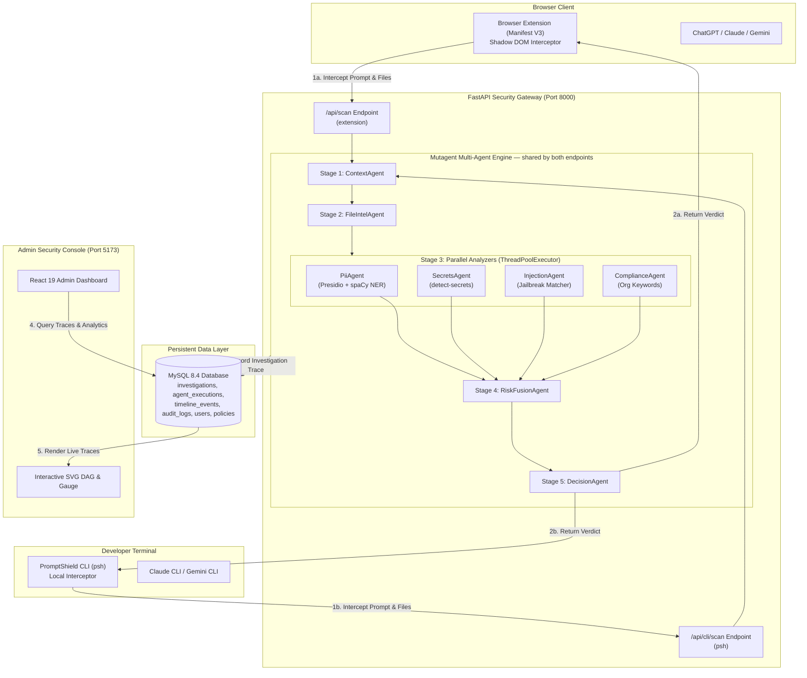

# System Architecture — PromptShield AI v2.0

PromptShield AI is an enterprise AI firewall composed of four primary subsystems, all sharing one backend and one detection pipeline — there is no duplicated security logic between them:
1. **Browser Extension (Manifest V3)**: Intercepts prompt text submissions and file attachments on `chatgpt.com`, `chat.openai.com`, `claude.ai`, and `gemini.google.com`.
2. **PromptShield CLI (`psh`)**: Intercepts prompts and file attachments before they reach the real **Claude CLI** or **Gemini CLI** binary on a developer's machine, via its own isolated `POST /api/cli/scan` endpoint that calls the identical pipeline.
3. **FastAPI Backend & Mutagent Engine**: A 5-stage Multi-Agent execution pipeline that processes input text and file attachments concurrently, invoked by both the extension and the CLI.
4. **React Admin Dashboard**: A web-based security console for configuring organization policies, viewing analytics, and inspecting **interactive SVG Multi-Agent Investigation DAGs** — for scans originating from either client.

---

## Overall Architecture Diagram

---

## Data Flow Lifecycle

1. **Client Interception**: When an employee hits "Send" or drops a file into ChatGPT, Claude, or Gemini, the extension's `content_scripts` intercept the DOM event before the web request leaves the browser. Equivalently, running `psh claude`/`psh gemini` intercepts the prompt and any `-f` file attachments before the real CLI binary ever launches.
2. **Mutagent Inspection**: The backend receives the JSON payload (`prompt`, `files`, `site`, `user`), passes it to the `ContextAgent`, extracts file text via `FileIntelAgent`, and spawns 4 parallel analyzer threads (`ThreadPoolExecutor`) — identically whether the request came from `/api/scan` (extension) or `/api/cli/scan` (`psh`).
3. **Risk Fusion & Verdict**: `RiskFusionAgent` applies org-defined analyzer risk multipliers, and `DecisionAnalyzer` checks priority rules to output an enforcement verdict (`ALLOW`, `WARN`, `REDACT`, `BLOCK`) for the prompt+files as a whole, plus an independent per-file verdict for each attachment (so one risky file in a batch doesn't have to block the rest).
4. **Audit Logging & Visualization**: The full trace is written to MySQL across `investigations`, `agent_executions`, and `timeline_events` tables (linked to the corresponding `audit_logs` row), instantly visible on the Admin Dashboard's `/investigations` and `/prompt-logs` pages regardless of which client produced the scan.

---

© 2026 PromptShield AI. Powered by Mutagent Multi-Agent Security Engine.
