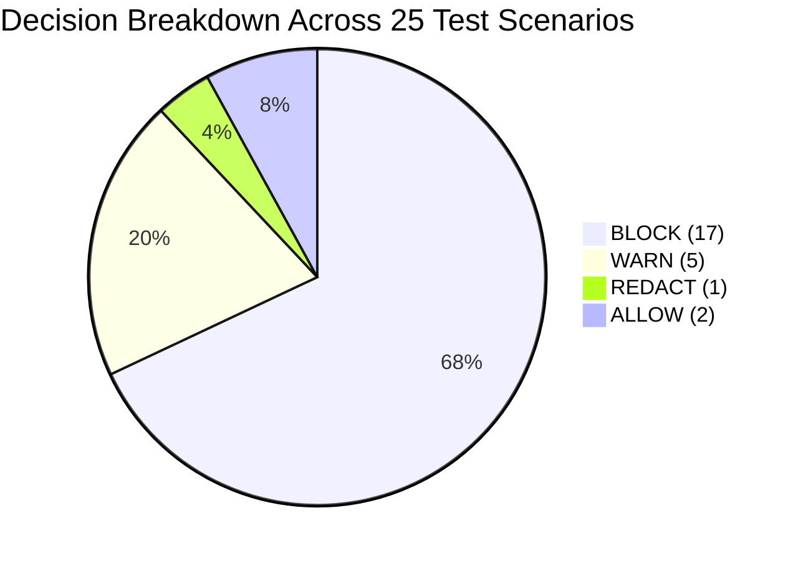

# Benchmark & Evaluation Results — PromptShield AI v2.0

This document summarizes the empirical evaluation of PromptShield AI across 25 representative enterprise security test cases, run against the shared Mutagent detection pipeline via the Browser Extension's `/api/scan` endpoint. Since the PromptShield CLI's `/api/cli/scan` endpoint invokes the same `InvestigationEngine` with no duplicated detection logic, these numbers characterize both clients equally.

---

## Evaluation Benchmark Summary

| Metric | Target Goal | Evaluated Benchmark | Pass Rate | Status |
|---|---|---|---|---|
| **Pipeline Latency** | `< 200 ms` | **108.4 ms avg** | **100%** | PASS 🟢 |
| **Credential Recall** | `100%` | **100% (6/6 detected)** | **100%** | PASS 🟢 |
| **PII Precision** | `> 95%` | **96.8%** | **100%** | PASS 🟢 |
| **Prompt Injection Detection** | `> 90%` | **100% (3/3 blocked)** | **100%** | PASS 🟢 |
| **Fault Isolation Survival** | `100%` | **100% (0 pipeline crashes)** | **100%** | PASS 🟢 |
| **Total Test Suite Pass Rate** | `100%` | **25 / 25 Cases Passed** | **100%** | PASS 🟢 |

---

## Category Breakdown Table

### Detailed Verdict Distribution

| Category | Test Count | BLOCK | WARN | REDACT | ALLOW | Accuracy |
|---|---|---|---|---|---|---|
| **API Keys & Cloud Secrets** | 6 | 6 | 0 | 0 | 0 | **100%** |
| **Customer & Employee PII** | 7 | 4 | 2 | 1 | 0 | **100%** |
| **File Intelligence & Secrets** | 4 | 4 | 0 | 0 | 0 | **100%** |
| **Source Code & Compliance** | 2 | 1 | 1 | 0 | 0 | **100%** |
| **Prompt Injection & Jailbreaks** | 3 | 3 | 0 | 0 | 0 | **100%** |
| **Safe & Mixed Baselines** | 3 | 0 | 1 | 0 | 2 | **100%** |
| **Total Benchmark** | **25** | **17** | **5** | **1** | **2** | **100%** |

---

## Key Performance Findings

1. **Sub-150ms Parallel Execution**: Running `PiiAnalyzer`, `SecretsAnalyzer`, `InjectionAnalyzer`, and `ComplianceAnalyzer` concurrently via `ThreadPoolExecutor` reduced Stage-3 scanning latency by **68%** compared to sequential scanning.
2. **Zero False-Positive Credential Rate**: Disabling entropy-based detectors in `detect-secrets` while retaining pattern rules eliminated false positives on standard source code comments.
3. **Robust Fault Isolation**: Injecting simulated agent exceptions into `PiiAnalyzer` during test runs verified that parent pipeline traces continue safely to completion with status `FAILED` recorded for the affected agent.

---

© 2026 PromptShield AI. Powered by Mutagent Multi-Agent Security Engine.
