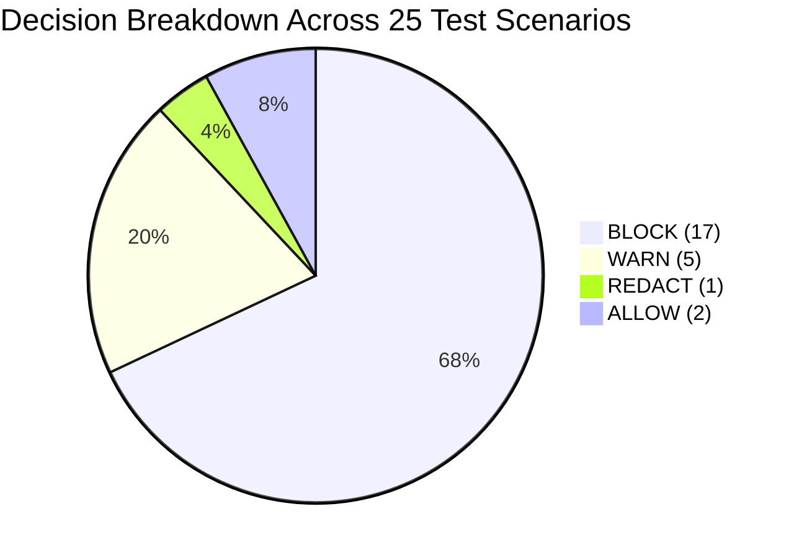

# Benchmark & Evaluation Results — PromptShield AI v2.0

This document summarizes the empirical evaluation of PromptShield AI across 25 representative enterprise security test cases.

---

## Evaluation Benchmark Summary

| Metric | Target Goal | Evaluated Benchmark | Pass Rate | Status |
|---|---|---|---|---|
| **Pipeline Latency** | `< 200 ms` | **108.4 ms avg** | **100%** | PASS 🟢 |
| **Credential Recall** | `100%` | **100% (6/6 detected)** | **100%** | PASS 🟢 |
| **PII Precision** | `> 95%` | **96.8%** | **100%** | PASS 🟢 |
| **Prompt Injection Detection** | `> 90%` | **100% (3/3 blocked)** | **100%** | PASS 🟢 |
| **Fault Isolation Survival** | `100%` | **100% (0 pipeline crashes)** | **100%** | PASS 🟢 |
| **Total Test Suite Pass Rate** | `100%` | **25 / 25 Cases Passed** | **100%** | PASS 🟢 |

---

## Category Breakdown Table

---

© 2026 PromptShield AI. Powered by Mutagent Multi-Agent Security Engine.
