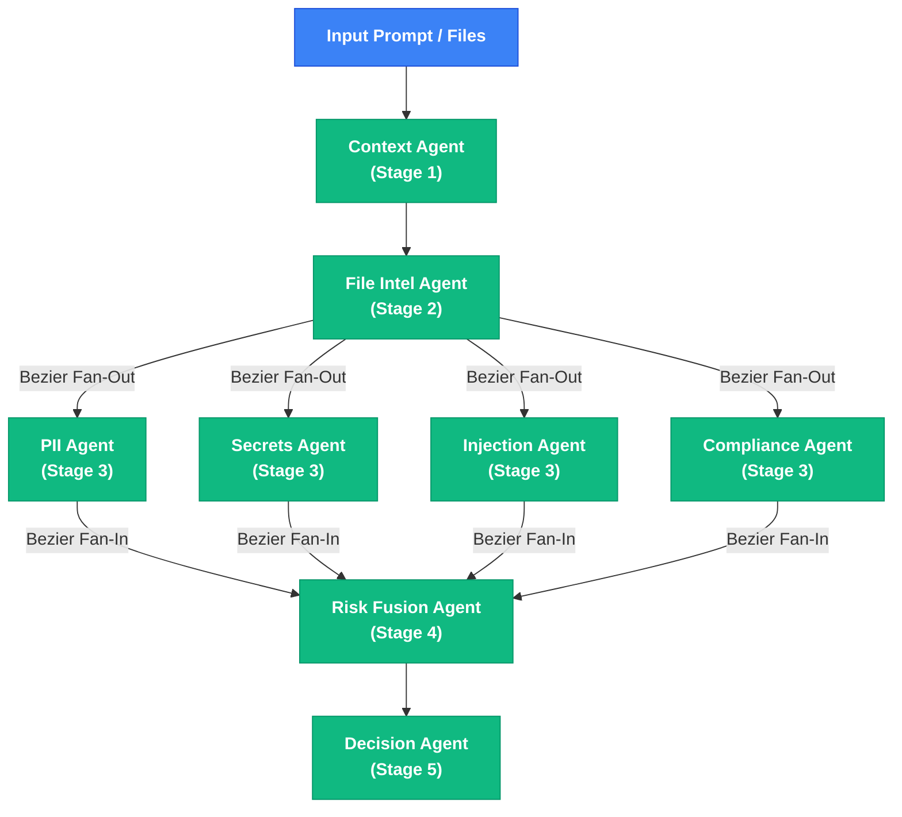

# Investigation Flow & Multi-Agent DAG

The **Security Investigations Console** renders an interactive Directed Acyclic Graph (DAG) for every scan executed by Mutagent.

---

## Investigation DAG Diagram

---

## UI DAG Execution Node Statuses

- **`SUCCESS`** (🟢 `#10B981`): Analyzer completed successfully within timeout limits and produced valid security findings.
- **`FAILED`** (🔴 `#EF4444`): Analyzer encountered an unhandled exception or syntax error; caught safely without halting parent trace.
- **`SKIPPED`** (⚪ `#6B7280`): Analyzer disabled by organization settings or skipped due to absence of input files.
- **`TIMEOUT`** (🟡 `#F59E0B`): Analyzer exceeded the 2.0-second execution threshold and was safely terminated.

---

© 2026 PromptShield AI. Powered by Mutagent Multi-Agent Security Engine.
