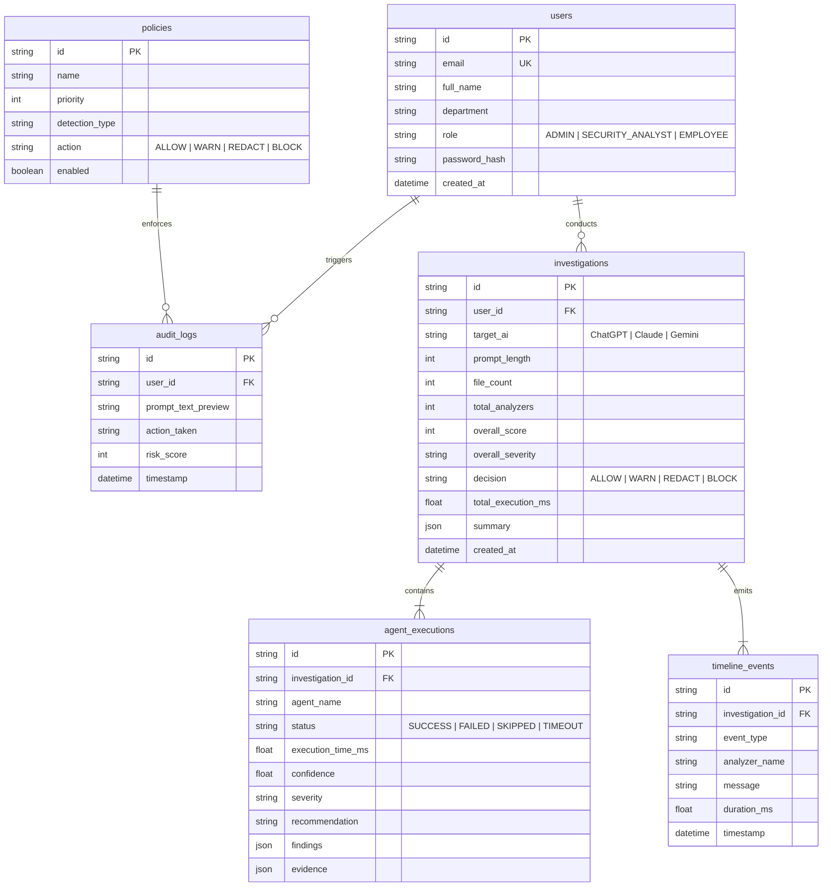
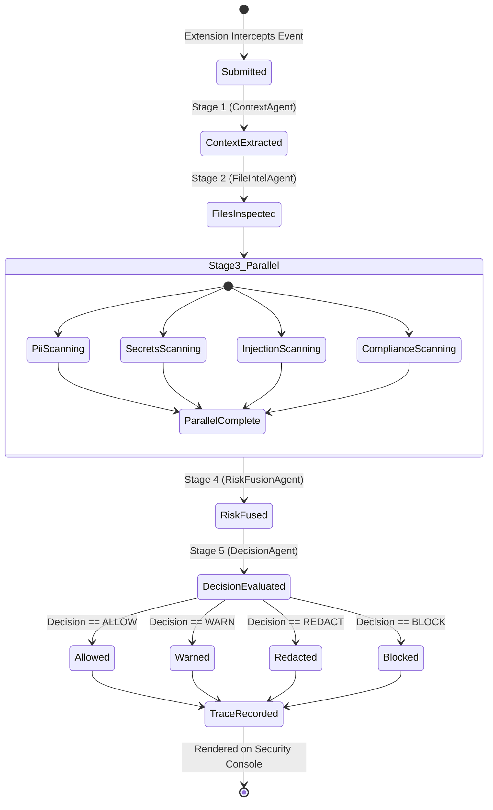

# Security Model & Data Governance — PromptShield AI v2.0

PromptShield AI enforces strict data governance, privacy controls, and audit trails.

---

## Database Relationships Diagram

---

## Investigation Lifecycle Diagram

---

## Security Guarantees & Privacy Controls

1. **Client-Side Dom Interception**: Prompts and file attachments are intercepted locally inside the browser before any HTTP request is dispatched to OpenAI, Anthropic, or Google servers.
2. **Metadata-Only MySQL Storage**: Prompt texts are previewed or masked in audit logs; raw uploaded file binaries are never stored in MySQL.
3. **Role-Based Access Control (RBAC)**:
   - `admin`: Full configuration access (policy authoring, keyword management, user management).
   - `security_analyst`: Read-only access to audit logs, analytics, and investigation traces.
   - `employee`: Standard user access for Chrome extension authentication.

---

© 2026 PromptShield AI. Powered by Mutagent Multi-Agent Security Engine.
