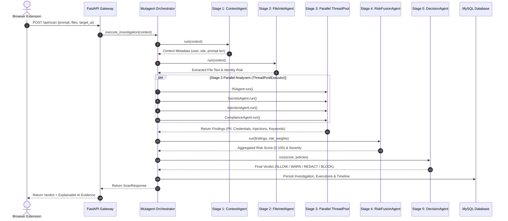

# Multi-Agent Workflow — Mutagent Detection Engine

The **Mutagent Multi-Agent Detection Engine** organizes security scanning into an isolated, fault-tolerant 5-stage Directed Acyclic Graph (DAG).

---

## Multi-Agent Workflow Diagram

---

## Stage Descriptions

1. **Stage 1 (Context)**: `ContextAgent` parses identity headers, user account attributes, and target AI domain.
2. **Stage 2 (File Intelligence)**: `FileIntelAgent` inspects file mime-types, checks file extension policies, and decodes binary/text content (`.pdf`, `.docx`, `.xlsx`, `.csv`, `.py`, `.js`, image OCR).
3. **Stage 3 (Parallel ThreadPool)**: Four specialized analyzers execute concurrently:
   - **`PiiAgent`**: Microsoft Presidio + spaCy NER.
   - **`SecretsAgent`**: `detect-secrets` 24 credential rules.
   - **`InjectionAgent`**: Jailbreak and prompt override pattern matcher.
   - **`ComplianceAgent`**: Company keyword list matcher.
4. **Stage 4 (Risk Fusion)**: `RiskFusionAgent` applies org risk multipliers (`risk_weights`) to construct a unified 0–100 risk score.
5. **Stage 5 (Decision Gate)**: `DecisionAgent` evaluates rules in priority order to return the final verdict.

---

© 2026 PromptShield AI. Powered by Mutagent Multi-Agent Security Engine.
